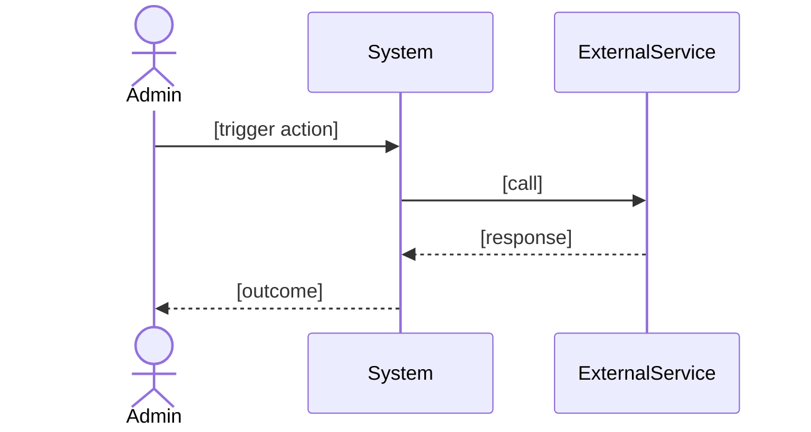

# [NNN] — [Feature Name]: Technical Plan

**Status:** Technical Planning
**Spec:** [`spec.md`](spec.md)
**Clarifications:** [`clarify.md`](clarify.md)
**Last Updated:** [DATE]

---

## Stack

| Concern | Solution | Rationale |
|---------|----------|-----------|
| [Concern 1] | [Solution] | [Why this choice] |
| [Concern 2] | [Solution] | [Why this choice] |

---

## Architecture

[One paragraph describing the high-level design and key patterns used.]

---

## Sequence Diagram *(mandatory — also save to sequence-diagram.md)*



> Save this diagram also as `sequence-diagram.md` in this feature directory.

---

## Constitution Check

*All gates must pass before implementation begins.*

- [ ] Privacy: No customer-identifying data leaves the Mac Mini without admin approval
- [ ] HITL: Human approval gate in place for all customer-facing output
- [ ] Budget: No unbounded AI API calls; hard daily limit respected
- [ ] Ownership: All code and data owned by client; no proprietary lock-in
- [ ] [Feature-specific gate]

---

## Technical Context

**Language/Version:** [e.g., Python 3.11]
**Primary dependencies:** [e.g., pytest, requests]
**Storage:** [e.g., local JSON state file + logs]
**Testing:** pytest + pytest-mock
**Target platform:** macOS (Mac Mini M-series)
**Project type:** [CLI script | background daemon | cron job]

---

## Implementation Phases

### Phase 0: Research

[What needs investigation before coding begins?]

**Output:** `research.md`

### Phase 1: Core Implementation

[What is the primary thing to build?]

**Output:** Working implementation + unit tests

### Phase 2: Integration

[How does this connect to existing infrastructure?]

**Output:** Integration tests + updated cron/Hermes config

---

## Project Structure

```text
{unit}/.specify/{NNN}-{feature}/
├── spec.md               # Requirements (/speckit-specify)
├── clarify.md            # Q&A (/speckit-clarify)
├── plan.md               # This file (/speckit-plan)
├── sequence-diagram.md   # Mermaid sequence diagram (/speckit-plan)
├── tasks.md              # Task breakdown (/speckit-tasks)
└── features/             # Gherkin acceptance tests (/speckit-tasks)
    └── *.feature
```

---

## Key Design Decisions

| Decision | Choice | Rationale |
|----------|--------|-----------|
| [Decision 1] | [Choice] | [Why] |
| [Decision 2] | [Choice] | [Why] |

---

## Open Questions

- [Question that needs resolution before or during implementation]
