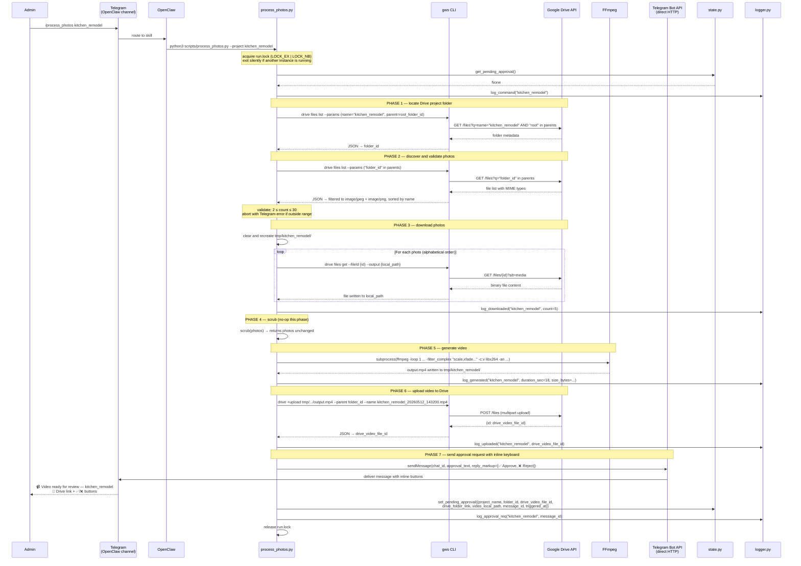
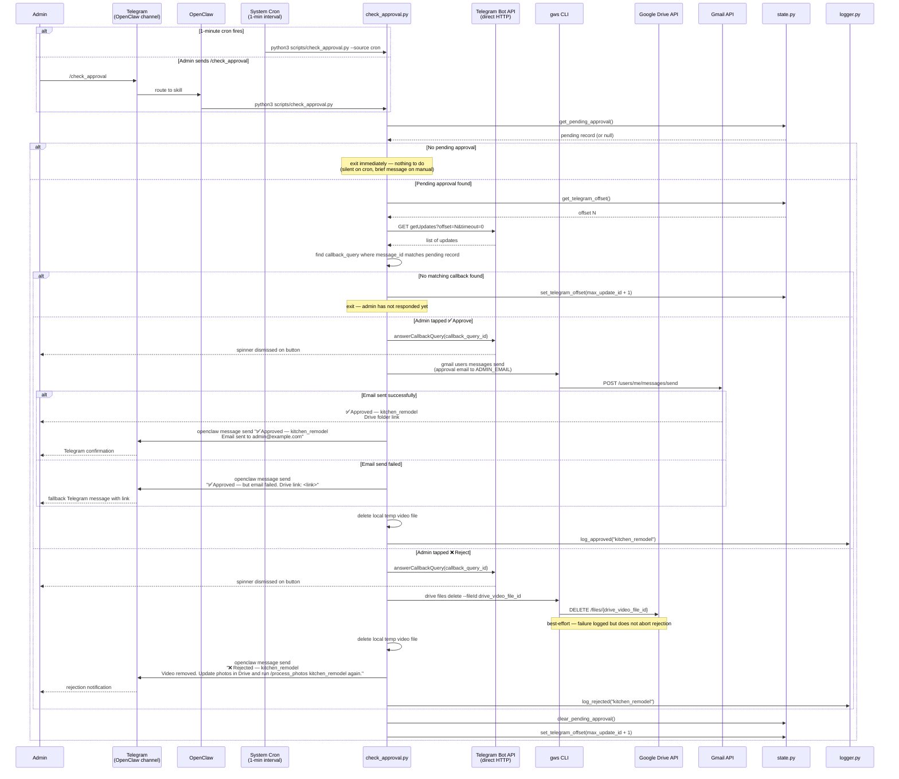

# 002 — Photo Video Agent: Sequence Diagram

**Last Updated:** 2026-05-12
**Source of truth:** [`techplan.md`](techplan.md) + [`clarify.md`](clarify.md)

> This diagram is generated from the spec. If the spec changes, regenerate using `/speckit.diagram`.

---

## Flow A — `process_photos.py` (command trigger → approval request)

---

## Flow B — `check_approval.py` (cron / on-demand → approve or reject)

---

## Error Paths Not Shown Above

| Scenario | Behavior |
|----------|----------|
| Drive folder not found | `DriveFolderNotFoundError` → Telegram error via OpenClaw; script exits |
| Fewer than 2 photos | Telegram error with count; script exits; no download attempted |
| More than 30 photos | Telegram error; script exits |
| Photo download fails | Telegram error with filename; temp dir cleaned; script exits |
| FFmpeg not installed | `FileNotFoundError` on subprocess → Telegram error "FFmpeg not found"; script exits |
| FFmpeg exits non-zero | `VideoGenerationError` with stderr → Telegram error with reason; script exits |
| Drive upload fails | Telegram error; local file retained for manual recovery; script exits |
| `run.lock` held by another instance | Second instance exits 0 silently |
| `pending_approval` exists when `/process_photos` arrives | Telegram error naming the pending project; no download; exits |
| Drive delete fails on rejection | Logged at ERROR; rejection still completes; state still cleared |
| Email fails on approval | Telegram fallback with Drive link; state still cleared |
| Mac Mini reboots while approval pending | `state.json` persists; next `check_approval.py` cron run picks up where it left off |
