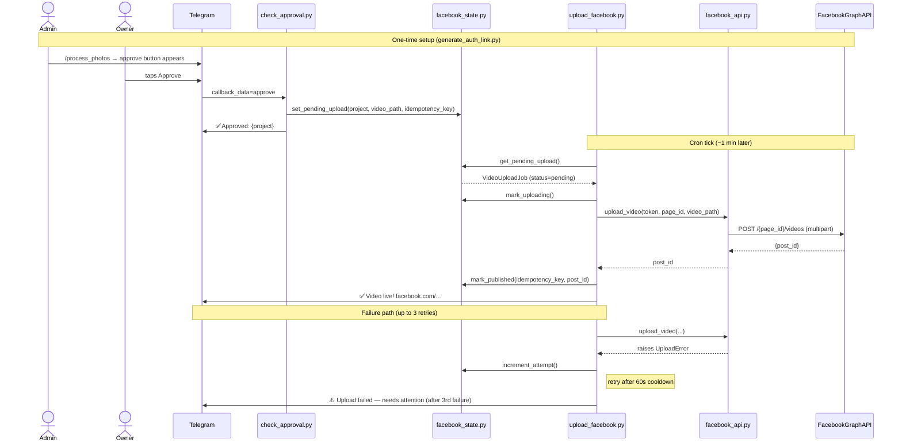

# 003 — Facebook Video Upload: Technical Plan

**Status:** Technical Planning
**Spec:** [`spec.md`](spec.md)
**Clarifications:** [`clarify.md`](clarify.md)
**Research:** [`research.md`](research.md)
**Data model:** [`data-model.md`](data-model.md)
**Contracts:** [`contracts/cli-contracts.md`](contracts/cli-contracts.md)
**Last Updated:** 2026-05-30

---

## Stack

| Concern | Solution | Rationale |
|---------|----------|-----------|
| Facebook API client | `requests` — direct Graph API v25.0 | Already a dependency; no SDK needed |
| OAuth callback | stdlib `http.server` on `localhost:8080` | No extra deps; clean CLI UX |
| State persistence | `facebook_state.json` + `fcntl` locking | Mirrors `state.py` pattern exactly |
| Retry logic | Timestamp-based cooldown in cron script | Matches cron cadence; no threads |
| Token storage | `.env` file | Consistent with existing credential pattern |
| Logging | `facebook_logger.py` → `photo-agent.log` | Single per-client log per spec |
| Video upload method | Non-resumable multipart POST | Videos are <100 MB; chunked not needed |
| Token acquisition | Short user → long user → permanent Page token | Page tokens from long user tokens never expire |

---

## Architecture

Feature 003 follows the same two-script cron pattern as Feature 002. `check_approval.py` (existing) gains one new responsibility on the approve path: it enqueues a `VideoUploadJob` in `facebook_state.json`. A new cron script, `upload_facebook.py`, runs every minute alongside the existing cron and drains that queue — uploading the video to Facebook via Graph API, retrying up to 3 times with 60-second cooldowns, and sending Telegram notifications on success or final failure. A one-time admin CLI script, `generate_auth_link.py`, handles the OAuth dance to obtain and store a permanent Page access token. The token is written to `.env` and consumed by the upload cron at runtime.

---

## Sequence Diagram *(also saved as sequence-diagram.md)*



---

## Constitution Check

*All gates must pass before implementation begins.*

- [x] **Privacy**: No customer-identifying data leaves the Mac Mini without admin approval. The video uploaded to Facebook is exclusively the client-approved video — the owner tapped Approve before FieldKit posts anything.
- [x] **HITL**: Human approval gate (Telegram button tap) is required before any Facebook post. FieldKit never publishes autonomously.
- [x] **Budget**: No AI API calls in this feature. The only external calls are to the Facebook Graph API (free for posting) and Telegram Bot API (free). Zero AI cost.
- [x] **Ownership**: `requests`, `python-dotenv`, `pytest`, `pytest-mock` — all open-source, no proprietary lock-in. Client owns all code.
- [x] **TDD**: Tests written alongside implementation — never after. All new tools and scripts will have unit tests; integration path will have end-to-end test.
- [x] **Token safety**: `FB_APP_SECRET` is used only in `generate_auth_link.py` (admin-run, never in cron). The permanent Page access token is the only credential in cron scripts.

---

## Technical Context

**Language/Version:** Python 3.11+
**Primary dependencies:** `requests`, `python-dotenv` (no new packages needed)
**Storage:** `data/photo-agent/facebook_state.json` — new file, same directory as `state.json`
**Logging:** `logs/photo-agent.log` — existing per-client log, extended with new event types
**Testing:** pytest + pytest-mock
**Target platform:** macOS (Mac Mini M-series)
**Project type:** Cron job (`upload_facebook.py`) + one-shot admin CLI (`generate_auth_link.py`)
**Facebook API:** Graph API v25.0, `graph.facebook.com`

---

## Implementation Phases

### Phase 0: Research

**Status: COMPLETE** — see `research.md`

Key decisions: non-resumable multipart POST, permanent Page token, stdlib local server for OAuth, timestamp-based retry in cron, `photo-agent.log` extended.

### Phase 1: Core Implementation

Build new tools and scripts in isolation, with full unit tests:

1. `tools/facebook_api.py` — Graph API wrapper
   - `build_auth_url()`, `exchange_code_for_token()`, `exchange_for_long_lived_token()`, `get_page_access_token()`, `upload_video()`
   - Custom exceptions: `FacebookTokenError` (irrecoverable), `FacebookUploadError` (retryable)

2. `tools/facebook_state.py` — `facebook_state.json` manager
   - `get_pending_upload()`, `set_pending_upload()`, `mark_uploading()`, `mark_published()`, `mark_failed()`, `increment_attempt()`, `is_published()`
   - Same `fcntl.LOCK_EX` pattern as `state.py`

3. `tools/facebook_logger.py` — Activity log events for Feature 003
   - `log_upload_enqueued()`, `log_upload_started()`, `log_upload_published()`, `log_upload_attempt_failed()`, `log_upload_exhausted()`, `log_token_expired()`
   - Writes to same `photo-agent.log`

4. `scripts/generate_auth_link.py` — One-time admin CLI
   - Local HTTP server on `localhost:PORT`, builds auth URL, exchanges code for permanent Page token, writes to `.env`

5. `scripts/upload_facebook.py` — Cron upload script
   - Reads pending job, checks cooldown, calls `facebook_api.upload_video()`, handles retry and failure paths, sends Telegram notifications

**Output:** All five files + unit tests (`test_facebook_api.py`, `test_facebook_state.py`, `test_facebook_logger.py`, `test_generate_auth_link.py`, `test_upload_facebook.py`)

### Phase 2: Integration

1. Extend `check_approval.py` approve path:
   - Import `facebook_state`
   - After `log_approved()`: call `facebook_state.set_pending_upload()`
   - Idempotency check before setting: if `is_published(idempotency_key)` → skip silently

2. Add `upload_facebook.py` to cron schedule (same cadence as `check_approval.py`)

3. Add new `.env` variables to `.env.example`

4. Integration test: approve a video → verify `facebook_state.json` transitions → verify Telegram confirmation mock is called

**Output:** Updated `check_approval.py`, `cron` config, `.env.example`, integration tests

---

## Project Structure

```text
clients/_demo/src/photo-agent/
├── scripts/
│   ├── check_approval.py          ← modified: enqueues FB upload on approve
│   ├── generate_auth_link.py      ← NEW: one-time admin OAuth CLI
│   ├── process_photos.py          ← unchanged
│   └── upload_facebook.py         ← NEW: cron upload script
├── tools/
│   ├── drive.py                   ← unchanged
│   ├── facebook_api.py            ← NEW: Graph API wrapper
│   ├── facebook_logger.py         ← NEW: activity log events for Feature 003
│   ├── facebook_state.py          ← NEW: facebook_state.json manager
│   ├── logger.py                  ← unchanged
│   ├── state.py                   ← unchanged
│   ├── telegram_api.py            ← unchanged
│   └── video_generator.py         ← unchanged
└── tests/
    ├── test_check_approval.py     ← extended: new FB enqueue assertions
    ├── test_facebook_api.py       ← NEW
    ├── test_facebook_logger.py    ← NEW
    ├── test_facebook_state.py     ← NEW
    ├── test_generate_auth_link.py ← NEW
    └── test_upload_facebook.py    ← NEW
```

---

## Key Design Decisions

| Decision | Choice | Rationale |
|----------|--------|-----------|
| Upload trigger | `check_approval.py` enqueues; cron drains | Non-blocking approval; retry logic lives in upload script |
| Token storage | `.env` — Page token only | App secret never in cron path; consistent with existing credential pattern |
| State isolation | Separate `facebook_state.json` | Feature 002 state untouched; clean rollback boundary |
| Error classification | `FacebookTokenError` (skip retries) vs `FacebookUploadError` (retry) | Token expiry (FB error 190) must not consume retry budget |
| Duplicate prevention | Idempotency key from Telegram `message_id` | Already unique per approval event; zero overhead |
| Local OAuth server | stdlib `http.server` | No new dependencies; admin runs once |
| Logging | Extend `photo-agent.log` | Single per-client log per spec; same pattern as Feature 002 |

---

## Open Questions

- None — all spec ambiguities resolved in `clarify.md` and `research.md`.

**Outside-code prerequisites** (non-blocking for coding):
- Admin creates Meta Developer App at developers.facebook.com
- Admin creates test Facebook Page on personal account
- Admin adds self as test user in the app (dev mode — no App Review needed)
