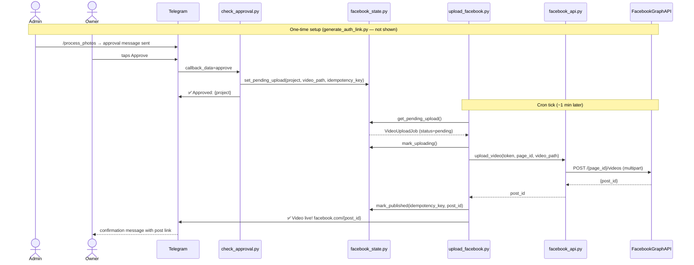
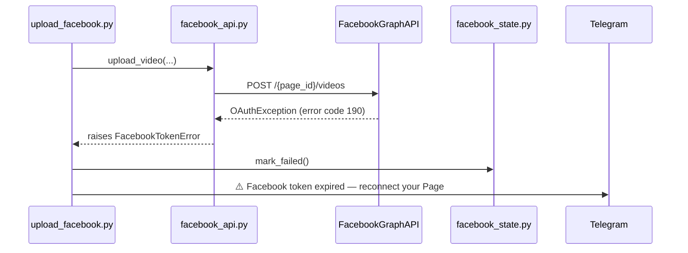

# Feature 003 — Sequence Diagram: Facebook Video Upload (Happy Path)



## Failure path — transient error with retry

```mermaid
sequenceDiagram
    participant upload_facebook.py
    participant facebook_api.py
    participant FacebookGraphAPI
    participant facebook_state.py
    participant Telegram

    upload_facebook.py->>facebook_api.py: upload_video(...)
    facebook_api.py->>FacebookGraphAPI: POST /{page_id}/videos
    FacebookGraphAPI-->>facebook_api.py: HTTP 500 / network error
    facebook_api.py-->>upload_facebook.py: raises FacebookUploadError
    upload_facebook.py->>facebook_state.py: increment_attempt() [count=1]
    Note right of upload_facebook.py: status stays uploading; exits

    Note over upload_facebook.py: 60s cooldown; next cron tick
    upload_facebook.py->>facebook_api.py: upload_video(...)
    facebook_api.py->>FacebookGraphAPI: POST /{page_id}/videos
    FacebookGraphAPI-->>facebook_api.py: {post_id}
    facebook_api.py-->>upload_facebook.py: post_id
    upload_facebook.py->>facebook_state.py: mark_published(...)
    upload_facebook.py->>Telegram: ✅ Video live! (no failure alert sent)
```

## Failure path — token expiry (irrecoverable)


