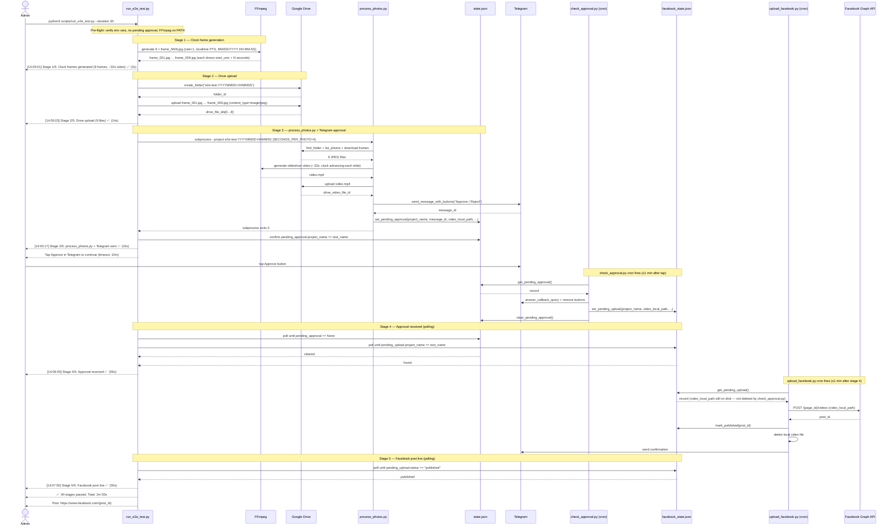

# Feature 004 — Sequence Diagram

**Feature:** End-to-End Test Rig (Happy Path)
**Generated:** 2026-06-20

> Note: `_delete_local_file` is moved from `check_approval.py` to `upload_facebook.py`'s success path (research.md §4). The local video file must survive until `upload_facebook.py` has used it.
