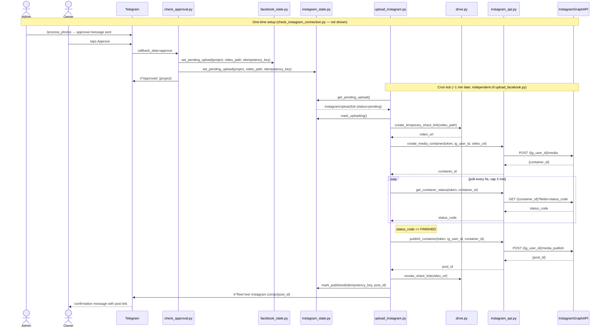
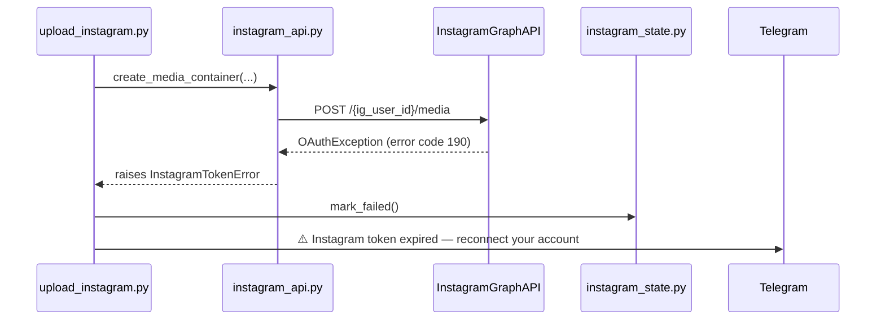
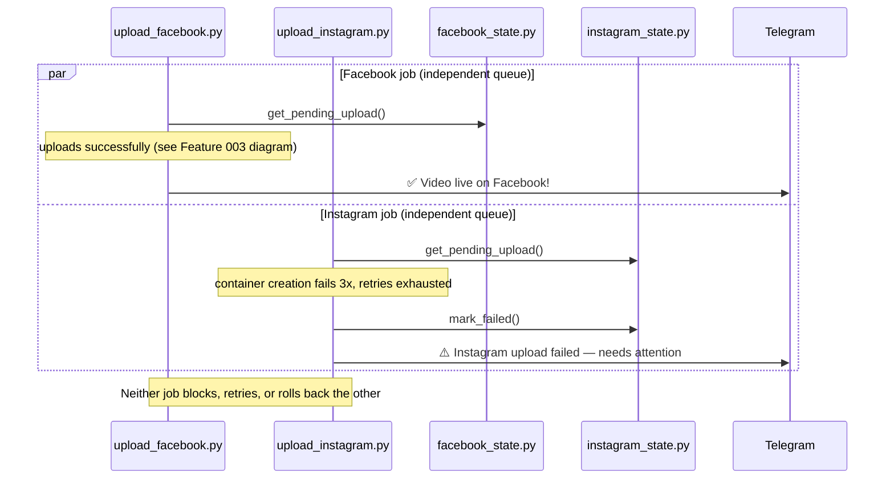

# Feature 005 — Sequence Diagram: Instagram Video Upload (Happy Path)



## Failure path — transient error with retry

```mermaid
sequenceDiagram
    participant upload_instagram.py
    participant instagram_api.py
    participant InstagramGraphAPI
    participant instagram_state.py
    participant Telegram

    upload_instagram.py->>instagram_api.py: create_media_container(...)
    instagram_api.py->>InstagramGraphAPI: POST /{ig_user_id}/media
    InstagramGraphAPI-->>instagram_api.py: HTTP 500 / network error
    instagram_api.py-->>upload_instagram.py: raises InstagramUploadError
    upload_instagram.py->>instagram_state.py: increment_attempt() [count=1]
    Note right of upload_instagram.py: status stays uploading; exits

    Note over upload_instagram.py: 60s cooldown; next cron tick
    upload_instagram.py->>instagram_api.py: create_media_container(...)
    instagram_api.py->>InstagramGraphAPI: POST /{ig_user_id}/media
    InstagramGraphAPI-->>instagram_api.py: {container_id}
    Note over upload_instagram.py: poll → publish (as in happy path)
    upload_instagram.py->>instagram_state.py: mark_published(...)
    upload_instagram.py->>Telegram: ✅ Reel live! (no failure alert sent)
```

## Failure path — token expiry (irrecoverable)



## Failure path — Instagram upload fails while Facebook upload succeeds (platform independence, FR-013)


