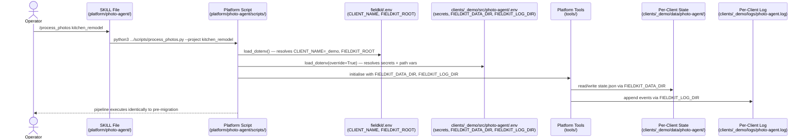

# 002 — Platform Photo-Agent: Technical Plan

**Status:** Technical Planning
**Spec:** [`spec.md`](spec.md)
**Last Updated:** 2026-07-03

---

## Stack

| Concern | Solution | Rationale |
|---------|----------|-----------|
| Language | Python 3.13 | Matches existing codebase |
| Config loading | python-dotenv (2-step) | Enables root→client env resolution without shell sourcing |
| HTTP | requests | Already in use for Drive, Telegram, Facebook APIs |
| Testing | pytest + pytest-mock | Existing test suite; all 363 tests must pass unchanged |
| State | Local JSON + fcntl file locking | Unchanged from current implementation |
| Logging | Append-only pipe-delimited log file | Unchanged; path resolved via FIELDKIT_LOG_DIR |
| Platform | macOS (Mac Mini M-series) | On-premise deployment; no cloud runtime |

---

## Architecture

The migration restructures the codebase into two layers with no behavior change. The **platform layer** (`platform/photo-agent/`) holds all pipeline code — scripts, tools, tests, SKILL files — and is shared across every client. The **client layer** (`clients/{name}/src/photo-agent/`) holds only a `.env` file with secrets and path overrides. A new **root config** (`fieldkit/.env`) acts as the machine identity, declaring which client is active (`CLIENT_NAME`) and where the repo lives (`FIELDKIT_ROOT`). At runtime, every platform script performs two-step environment loading: root config first (identity), then client config (secrets and paths, taking precedence). State files and logs are written to per-client directories resolved from `FIELDKIT_DATA_DIR` and `FIELDKIT_LOG_DIR`, which must be explicitly set in each client's `.env` — there is no fallback.

---

## Sequence Diagram *(also saved to sequence-diagram.md)*



> Saved also as [`sequence-diagram.md`](sequence-diagram.md).

---

## Constitution Check

*All gates must pass before implementation begins.*

- [x] **Privacy:** No change to metadata scrubbing or customer data handling — migration is structural only.
- [x] **HITL:** Human approval gate (Telegram inline keyboard → check_approval) is unchanged.
- [x] **Budget:** No AI API calls introduced; this is a pure code relocation.
- [x] **Ownership:** All code remains client-owned and self-hosted. Multi-client architecture enhances ownership by keeping each client's secrets isolated in their own folder.
- [x] **Migration gate:** All 363 existing `_demo` tests must pass after migration before the feature is considered complete.

---

## Technical Context

**Language/Version:** Python 3.13
**Primary dependencies:** requests, python-dotenv, pytest, pytest-mock
**Storage:** Local JSON state files + append-only log file; paths resolved via `FIELDKIT_DATA_DIR` / `FIELDKIT_LOG_DIR`
**Testing:** pytest + pytest-mock; existing suite relocates verbatim to `platform/photo-agent/tests/`
**Target platform:** macOS (Mac Mini M-series)
**Project type:** CLI scripts (SKILL-invoked) + cron jobs

---

## Implementation Phases

### Phase 0: Research

No significant technical unknowns — all key decisions were resolved during the design brainstorm. One decision to document:

**2-step env loading pattern**
- Decision: `load_dotenv(root/.env)` then `load_dotenv(client/.env, override=True)`
- Rationale: Separates machine identity (root) from client secrets (client); `override=True` ensures client values always win; no shell sourcing required; works in cron and SKILL contexts identically.
- Alternative considered: `--config <path>` flag on every script — rejected because it requires SKILL files to know the client path, breaking the goal of generic SKILLs.

**`parents[3]` fallback for `FIELDKIT_ROOT`**
- Decision: `Path(os.environ.get("FIELDKIT_ROOT", str(Path(__file__).parents[3])))`
- Rationale: Platform scripts are always exactly 3 directory levels below the repo root (`platform/photo-agent/scripts/`), so the fallback is reliable and non-fragile for this fixed layout.
- Alternative considered: require `FIELDKIT_ROOT` with no fallback — rejected as unnecessarily strict for a fixed-layout monorepo.

**Output:** No `research.md` needed — decisions documented inline above.

---

### Phase 1: File Migration + Config Wiring

Create the platform directory structure, move all code, and wire up the two-level config loading. No functional changes to pipeline logic.

**Steps:**
1. Create `platform/photo-agent/` with `scripts/`, `tools/`, `tests/`, `docs/` subdirectories.
2. Move all Python source files from `clients/_demo/src/photo-agent/tools/` → `platform/photo-agent/tools/`.
3. Move all Python scripts from `clients/_demo/src/photo-agent/scripts/` → `platform/photo-agent/scripts/`.
4. Move all test files from `clients/_demo/src/photo-agent/tests/` → `platform/photo-agent/tests/`.
5. Move `docs/facebook/` → `platform/photo-agent/docs/facebook/`.
6. Move `requirements.txt` → `platform/photo-agent/requirements.txt`.
7. Update `state.py` and `logger.py`: remove `Path(__file__).parents[5]` fallback; require `FIELDKIT_DATA_DIR` / `FIELDKIT_LOG_DIR` or raise a clear `RuntimeError`.
8. Update every script entrypoint (`process_photos.py`, `check_approval.py`, `upload_facebook.py`, `generate_auth_link.py`, `setup_drive_auth.py`) to replace `load_dotenv(Path(__file__).parents[1] / ".env")` with the 2-step loading pattern.
9. Create `fieldkit/.env.example` documenting `CLIENT_NAME` and `FIELDKIT_ROOT`.
10. Create `fieldkit/.env` with `CLIENT_NAME=_demo` and the absolute `FIELDKIT_ROOT` for this machine.
11. Update `clients/_demo/src/photo-agent/.env` and `.env.example` to add `FIELDKIT_DATA_DIR` and `FIELDKIT_LOG_DIR` pointing to `clients/_demo/data/` and `clients/_demo/logs/`.
12. Delete moved source files from `clients/_demo/src/photo-agent/` — leaving only `.env` and `.env.example`.
13. Move existing `data/photo-agent/` state files from repo root → `clients/_demo/data/photo-agent/` (one-time operator step; document in migration note).
14. Verify `platform/photo-agent/tests/` test suite: all 363 tests pass.

**Output:** Working platform/photo-agent with _demo wired and all tests green.

---

### Phase 2: SKILL Files + Verification

Move SKILL files to the platform, update invocation paths, and confirm end-to-end behavior.

**Steps:**
1. Move `SKILL_process_photos.md`, `SKILL_check_approval.md`, `SKILL_upload_facebook.md`, `SKILL_generate_auth_link.md` from `clients/_demo/src/photo-agent/` → `platform/photo-agent/`.
2. Update each SKILL file: replace `cd ~/src/fieldkit/clients/_demo/src/photo-agent` + relative script path with `python3 ~/src/fieldkit/platform/photo-agent/scripts/<script>.py`.
3. Create `platform/photo-agent/.env.example` documenting all client-side variables (including `FIELDKIT_DATA_DIR`, `FIELDKIT_LOG_DIR`, and all secrets).
4. Update `CLAUDE.md` active feature pointer to `platform/.specify/002-photo-agent`.
5. Run full test suite from `platform/photo-agent/` — confirm 363 tests pass.
6. Manually verify the `/process_photos` → `/check_approval` → `/upload_facebook` flow end-to-end with `_demo` config.

**Output:** Platform SKILL files live, _demo client fully operational, CLAUDE.md updated.

---

## Project Structure

```text
platform/.specify/002-photo-agent/
├── spec.md                  # Requirements (/speckit-specify)
├── plan.md                  # This file (/speckit-plan)
├── sequence-diagram.md      # Mermaid sequence diagram (/speckit-plan)
├── tasks.md                 # Task breakdown (/speckit-tasks)
└── features/                # Gherkin acceptance tests (/speckit-tasks)
    └── *.feature

platform/photo-agent/        # ← all code lands here
  scripts/
  tools/
  tests/
  docs/
  SKILL_*.md
  requirements.txt
  .env.example

clients/_demo/
  src/photo-agent/           # ← config only after migration
    .env
    .env.example
  data/photo-agent/          # ← state files (moved from repo root)
  logs/                      # ← log file (moved from repo root)

fieldkit/
  .env                       # ← NEW: CLIENT_NAME + FIELDKIT_ROOT
  .env.example               # ← NEW
```

---

## Key Design Decisions

| Decision | Choice | Rationale |
|----------|--------|-----------|
| Config injection | 2-step env loading (root → client) | Generic SKILL files; no per-client paths in platform code |
| SKILL file location | `platform/photo-agent/` | Single copy; no per-client duplication |
| `FIELDKIT_ROOT` resolution | Env var with `parents[3]` fallback | Explicit when configured; reliable fallback for fixed monorepo layout |
| `FIELDKIT_DATA_DIR` / `FIELDKIT_LOG_DIR` | Required; no fallback | Forces explicit per-client isolation; silent fallback caused bugs with old `parents[5]` offset |
| Source of truth for active client | `fieldkit/.env` → `CLIENT_NAME` | Machine-level identity; single place to change when switching clients |
| Data migration | Manual operator step | Only one active client; no automated script needed |

---

## Open Questions

None — all decisions resolved in design and planning phases.
