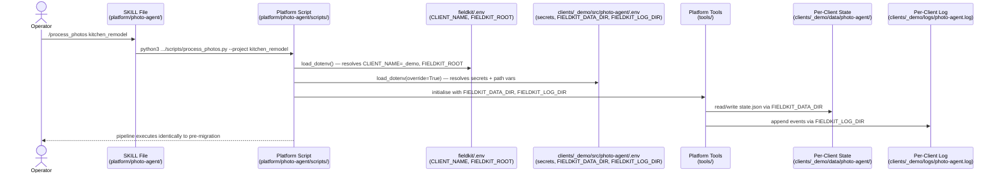

# Sequence Diagram — Platform Photo-Agent Config Resolution

```mermaid
sequenceDiagram
    actor Operator
    participant Skill as SKILL File<br/>(platform/photo-agent/)
    participant Script as Platform Script<br/>(platform/photo-agent/scripts/)
    participant RootEnv as fieldkit/.env<br/>(CLIENT_NAME, FIELDKIT_ROOT)
    participant ClientEnv as clients/_demo/src/photo-agent/.env<br/>(secrets, FIELDKIT_DATA_DIR, FIELDKIT_LOG_DIR)
    participant Tools as Platform Tools<br/>(tools/)
    participant Data as Per-Client State<br/>(clients/_demo/data/photo-agent/)
    participant Log as Per-Client Log<br/>(clients/_demo/logs/photo-agent.log)

    Operator->>Skill: /process_photos kitchen_remodel
    Skill->>Script: python3 .../scripts/process_photos.py --project kitchen_remodel
    Script->>RootEnv: load_dotenv() — resolves CLIENT_NAME=_demo, FIELDKIT_ROOT
    Script->>ClientEnv: load_dotenv(override=True) — resolves secrets + path vars
    Script->>Tools: initialise with FIELDKIT_DATA_DIR, FIELDKIT_LOG_DIR
    Tools->>Data: read/write state.json via FIELDKIT_DATA_DIR
    Tools->>Log: append events via FIELDKIT_LOG_DIR
    Script-->>Operator: pipeline executes identically to pre-migration
```
