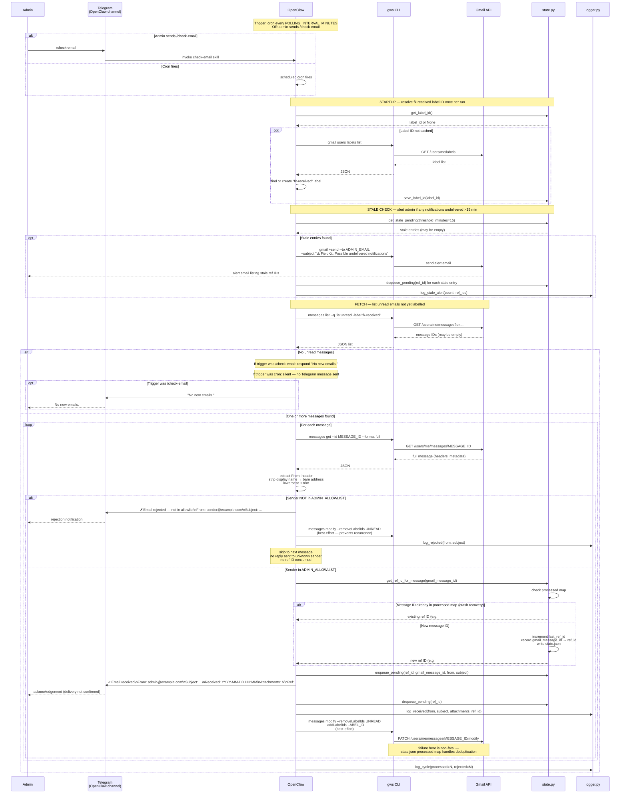

# 001 — Email Agent: Sequence Diagram

**Last Updated:** 2026-05-09
**Source of truth:** [`techplan.md`](techplan.md) + [`clarify.md`](clarify.md)

> This diagram is generated from the spec. If the spec changes, regenerate using `/speckit.diagram`.

---

---

## Error Paths Not Shown Above

| Scenario | Behavior |
|----------|----------|
| Gmail unreachable | `gws messages list` fails → log error, skip cycle, retry at next cron interval |
| Telegram unreachable | Message stays in `pending.json`; stale alert email sent to admin after 15 min |
| Stale alert email fails | Log failure, no further action |
| `gws modify` fails (label/mark-read) | Non-fatal — `state.json` processed map prevents reprocessing |
| `state.json` missing | `state.py` creates it with defaults |
| `pending.json` missing | `state.py` creates it with empty pending array |
