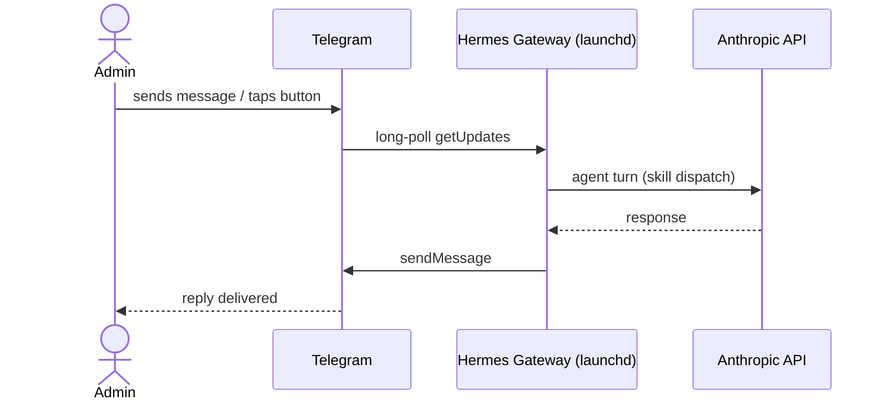

# Hermes Agent — Telegram Gateway Setup (Mac Mini / `servicehub-dev`)

Covers issue #6: replacing OpenClaw's Telegram gateway with Hermes's, with
Anthropic as the default model provider. Builds on
[`01-install.md`](01-install.md) (issue #5). Skill dispatch
(`process_photos`, `check_approval`) is separate (#7, #8) — this note stops at
a working, supervised gateway that receives a Telegram message and replies.

Source: [`platform/.specify/003-hermes-runtime/spec.md`](../../.specify/003-hermes-runtime/spec.md) (FR-001, FR-004).

## Sequence — happy path



## What was configured

1. **Model provider — Anthropic, default.**
   ```bash
   hermes config set model.provider anthropic
   hermes config set model.default claude-sonnet-5
   ```
   `ANTHROPIC_API_KEY` was added to `~/.hermes/.env` directly by the admin
   (not passed through this session — see PR discussion). Verified with
   `hermes doctor` → `✓ Anthropic API`.

   Chose `claude-sonnet-5` (Claude 5 family) over the config template's
   stale default (`claude-opus-4.6`) — current-generation model, and Sonnet
   is the right cost/capability point for tool-calling skill dispatch versus
   Opus.

2. **Telegram credentials — reused the existing `_demo` bot.**
   `TELEGRAM_BOT_TOKEN` and `TELEGRAM_ALLOWED_USERS` (the admin's chat ID)
   were copied from `clients/_demo/src/photo-agent/.env` into
   `~/.hermes/.env` — this is the same bot OpenClaw was already using, not a
   new one. Copied via a script that reads the source value and writes it
   directly to the destination file without the value passing through the
   session transcript.

   Also required: `python-telegram-bot` (optional Hermes dependency, not
   installed by `--skip-browser` since it isn't a browser tool):
   ```bash
   cd ~/.hermes/hermes-agent
   uv pip install python-telegram-bot --python ~/.hermes/hermes-agent/venv/bin/python
   ```

3. **Gateway installed as an always-on supervisor**, mirroring OpenClaw's
   prior `launchd` behavior:
   ```bash
   hermes gateway install --start-now --start-on-login
   ```
   Installs `~/Library/LaunchAgents/ai.hermes.gateway.plist` (label
   `ai.hermes.gateway`), auto-restarts on crash, auto-starts at login.

## Quirk: Telegram single-poller conflict with OpenClaw

Telegram's Bot API allows only one active `getUpdates` long-poll per bot
token. Since Hermes is reusing OpenClaw's bot token, both gateways running
at once produced:

```
Conflict: terminated by other getUpdates request; make sure that only one
bot instance is running
```

**Fix:** unloaded (not uninstalled) OpenClaw's launchd service —
`launchctl unload ~/Library/LaunchAgents/ai.openclaw.gateway.plist` — freeing
the poll for Hermes. This is reversible (`launchctl load` to restore) and was
confirmed with the admin before running, since it stops a live service. Full
OpenClaw uninstall is separate (#14), once #7/#8 port the remaining skills
and there's nothing left depending on it.

## Verification

Manual checklist (no automated test for gateway supervision itself — a
running background service isn't something a unit test exercises):

- [x] `hermes doctor` → `✓ Anthropic API`
- [x] `hermes gateway status` → `✓ Gateway is supervised by launchd (PID ...)`, auto-start and auto-restart both available
- [x] Gateway log shows `[Telegram] Connected to Telegram (polling mode)` and `✓ telegram connected`
- [x] Admin sent `/start` → correctly ignored as a platform ping (`Ignoring /start platform ping for session agent:main:telegram:dm:<chat_id>` — expected Hermes behavior, not routed to the agent)
- [x] Admin sent a plain-text message (`Hi`) → logged as `inbound message: platform=telegram user=Sandeep Kesarkar chat=<chat_id> msg='Hi'`, dispatched to Anthropic (`response ready: ... api_calls=1 response=436 chars`), and delivered back to Telegram

```
2026-08-14 10:36:41 [Telegram] Flushing text batch agent:main:telegram:dm:<chat_id> (2 chars)
2026-08-14 10:36:41 inbound message: platform=telegram user=Sandeep Kesarkar chat=<chat_id> msg='Hi' ...
2026-08-14 10:36:48 response ready: platform=telegram chat=<chat_id> time=7.2s api_calls=1 response=436 chars
2026-08-14 10:36:48 [Telegram] Sending response (436 chars) to <chat_id>
```

## Switching a client to OpenAI

**Corrected by #12 — see
[`09-per-client-model-profiles.md`](09-per-client-model-profiles.md) for the
verified mechanism and full rationale.** The guidance originally written here
was wrong on two counts: `openai-codex` is OAuth ChatGPT/Codex-subscription
auth, not a plain API key, and bare `provider: "openai"` silently aliases to
the OpenRouter aggregator rather than calling OpenAI directly. The correct
provider identity for a plain API key is `openai-api`
(`hermes_cli/providers.py`'s `HermesOverlay` for it points at
`https://api.openai.com/v1` and reads `OPENAI_API_KEY`) — confirmed against
`hermes auth list`, which already shows that credential available on this
machine.

**Further superseded by issue #61:** the per-client-Hermes-profile
mechanism described just below (`hermes profile create <client>`) was this
project's answer to the multi-client open question for a while, but was
retired — it was the direct root cause of issue #59. See
[`09-per-client-model-profiles.md`](09-per-client-model-profiles.md) for
the current model: exactly one client installed at a time, via
`platform/photo-agent/scripts/install_client.sh`, using Hermes's single
default profile only. The paragraph below is left as historical record of
what was tried and why it didn't hold up.

Per-client provider isolation used one **Hermes profile per client**
(`hermes profile create <client>`, `hermes -p <client> config set
model.provider openai-api`), not a shared global `config.yaml` and not
`platforms.api_server.extra.model_routes` (that block is scoped to the
`api_server` platform, not Telegram). `venus` (#12) and `mercury` (#11)
each got their own profile and their own Telegram bot pair; `_demo` kept
the default profile described in this document
unchanged.

## Install/config locations touched

| What | Where |
|---|---|
| Model provider config | `~/.hermes/config.yaml` (`model.provider`, `model.default`) |
| Secrets | `~/.hermes/.env` (`ANTHROPIC_API_KEY`, `TELEGRAM_BOT_TOKEN`, `TELEGRAM_ALLOWED_USERS`) |
| Gateway supervisor | `~/Library/LaunchAgents/ai.hermes.gateway.plist` |
| Gateway logs | `~/.hermes/logs/gateway.log` |
| OpenClaw gateway (unloaded, not removed) | `~/Library/LaunchAgents/ai.openclaw.gateway.plist` |

## Next steps (separate issues)

- #7 / #8 — port `process_photos` / `check_approval` dispatch as Hermes skills (done — see `03-process-photos-skill.md`, `04-check-approval-skill.md`; #8's button-callback trigger stays on its existing cron leg, not Hermes, per FR-002a)
- #11 / #12 — Anthropic-backed / OpenAI-backed demo customers (resolves the multi-client provider question above — see `09-per-client-model-profiles.md`)
- #14 — uninstall OpenClaw once nothing depends on it
