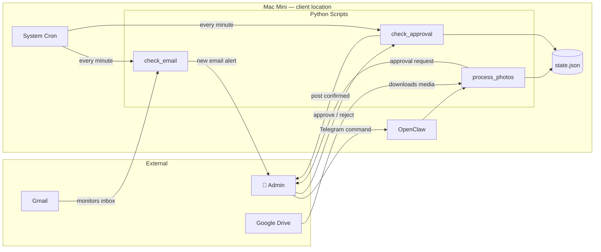

# [Week of 2026-05-24] — No features shipped. Fixed the tooling instead.

---

No feature this week. Spent the week fixing the foundation before building on it.

FieldKit uses [spec-kit](https://github.com/github/spec-kit) — a spec-driven development methodology where requirements are fully defined before any code is written. The problem: I'd been *mimicking* the spec-kit workflow manually. Naming conventions, directory structure, template files — all hand-crafted. No actual CLI. No slash commands. No enforced conventions.

So this week I wired up the real thing.

**What changed:**

→ Installed the `specify` CLI (v0.8.12) and integrated it with Claude Code via slash commands (`/speckit-specify`, `/speckit-plan`, etc.)
→ Migrated all existing feature specs to the spec-kit flat directory layout
→ Created FieldKit-specific template overrides — a hybrid spec format that keeps FieldKit's Privacy + HITL sections on top of spec-kit's User Story structure
→ Wrote a FieldKit constitution for the framework: Privacy, Human-in-the-Loop, Budget Governance, Client Ownership, and TDD as non-negotiable gates that every feature must pass before implementation
→ Added a Mermaid architecture diagram to the README so readers can see the system at a glance:

**The thing I keep running into: the gap between mimicking a process and actually using it.**

It's easy to copy a naming convention and call it "using spec-kit." But the spec-kit CLI enforces the workflow — it writes the spec file, creates the feature pointer, validates the sequence. When you wire up the real tooling, the process becomes a constraint, not a suggestion. That's the point.

Feature 001 and 002 were built without the real tooling. Feature 003 (caption generation) will be the first feature built start-to-finish with the actual spec-kit slash commands.

**Also fixed this week:** the README was showing stale directory paths and the wrong slash command format (dots instead of hyphens). Small things, but the README is the front door — it should reflect reality.

Building in public — more to come.

Code: github.com/sandeepkesarkar/fieldkit

#buildinpublic #claudecode #ai #python #automation #specdriven

---

*Published: [LinkedIn post URL — add after publishing]*
