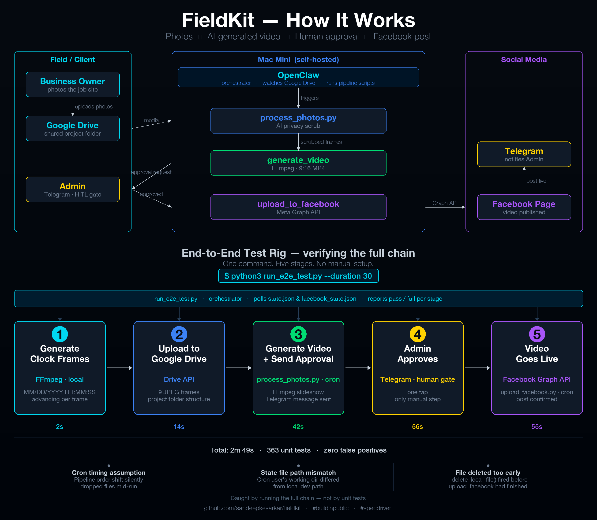

# [Week of 2026-06-26] — MVP shipped. Then I tested it properly.

---

**What is FieldKit?**

FieldKit is an AI-powered social media automation framework I'm building for small business owners who don't have time to manage their online presence consistently. The user story is simple: a business owner uploads a few photos to a shared Google Drive folder and triggers OpenClaw — a self-hosted AI agent runtime — to start processing. From there it's fully automatic: OpenClaw assembles the photos into a short MP4 video using FFmpeg, sends it to me on Telegram for review, and once I tap Approve, posts it to their Facebook Page. That's the entire interaction. Upload photos, get a post.

I'm building it in public, one feature at a time.

---

Feature 003 shipped: FieldKit can now take a series of photos, assemble them into an MP4 video, get human approval via Telegram, and post it to a Facebook Page — automatically. End to end. That's the MVP.

But shipping the feature wasn't enough. I needed to know the full pipeline actually works — not just in unit tests, but end to end, with real credentials, real API calls, real state files.

So I built Feature 004: a test rig.

**One command. No manual setup. Five stages.**

```
$ python3 run_e2e_test.py --duration 30
```

Upon script execution it:

- Generates synthetic clock-face frames with FFmpeg — MM/DD/YYYY HH:MM:SS advancing in real time
- Uploads them to Google Drive in the exact folder structure the pipeline expects
- Triggers `process_photos.py` to assemble the video and send the Telegram approval request
- Waits for the admin to tap Approve (the only manual step — intentionally kept to honour the human-in-the-loop gate)
- Polls until `upload_facebook.py` confirms the post is live on the Facebook Page

Each stage reports pass/fail with elapsed time as it completes. Total run: under 3 minutes.

**What the rig found that unit tests couldn't:**

Three real bugs surfaced only when running the full chain:

- A cron timing assumption that silently dropped files if the pipeline stage order shifted
- A state file path that worked in local dev but resolved differently under the cron user's working directory
- `_delete_local_file()` firing in `check_approval.py` before `upload_facebook.py` had finished reading the file — a one-line fix, but impossible to catch without the full chain running

Unit tests verify seams you can see. The e2e rig verifies the seams between components you assumed were compatible.

**363 unit tests. 5 stages. 2m 49s total.**



Building in public — more to come.

Code: github.com/sandeepkesarkar/fieldkit

#buildinpublic #claudecode #ai #python #automation #testing #mvp #openclaw

---

*Published: [LinkedIn post URL — add after publishing]*
