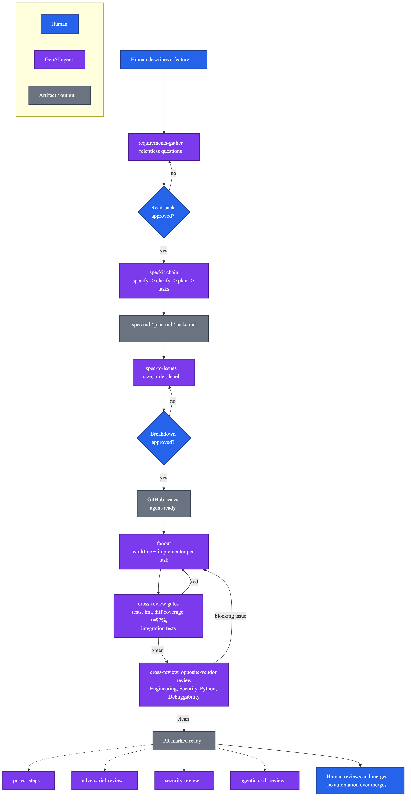

# Building a Multi-Agent Development Framework — and Watching It Catch Its Own Bugs

*A deep technical companion to [this week's build-in-public update](#).*

---

## The premise

In May I wrote about a pattern that stuck with me: after finishing a feature, run a *separate* AI agent whose only job is to find everything wrong with it. No diplomacy, no context on why a decision was made — just "here's a diff, break it." It caught a state-atomicity bug, a PII leak into debug logs, a cross-chat spoofing vector, and a crash-unsafe file writer, all in one pass, on code I'd already reviewed myself.

That pattern — an independent reviewer as a mandatory gate, not a suggestion — turned out to be the seed of something bigger. If one gate helps, what does the *whole* development lifecycle look like when it's built the same way: enforced, not suggested, at every stage from "a human has an idea" to "a PR is merged"?

That question became [**agent-dev-kit**](https://github.com/sandeepkesarkar/agent-dev-kit), a spec-first, multi-agent development framework, open-sourced under MIT. This is the technical story of building it, using it live to build [FieldKit](https://github.com/sandeepkesarkar/fieldkit), and — importantly — the parts that didn't work on the first try.

## The pipeline

Nine skills, each doing one job, chained together — some by the orchestrator's own judgment (model-driven routing), some by hard-coded procedure (a skill's own steps explicitly dispatching the next one):



**`requirements-gather`** is the front door — relentless Q&A, then a full verbatim read-back the human has to explicitly approve before anything downstream moves. **`spec-to-issues`** turns an approved spec into a sized, dependency-ordered GitHub issue breakdown — a second, distinct approval, since "what to build" and "how it's split up" are different decisions. **`fanout`** dispatches each task to its own git worktree and its own implementer. **`cross-review`** is where the real teeth are: every PR is gated on tests, lint, diff coverage ≥97% (via `diff-cover`, computed only over the lines the PR actually changed — a repo's legacy baseline shouldn't block a small PR), and integration tests — *before* a different-vendor reviewer (Claude implements, Codex reviews, by default) checks it against four standing dimensions: Engineering, Security, Python engineering, and Debuggability. Four more skills are on-demand rather than mandatory: a manual-QA-script generator, a hostile-input reviewer, a wrapped security scan, and — the one I'm most pleased with — `agentic-skill-review`, which audits the *skills themselves* against OWASP's Agentic Skills Top 10, on the theory that a compromised or over-privileged skill is a risk none of the other reviewers would ever catch, since they only ever see the diff a skill's implementer produced.

None of this needed a new event-driven hook. Mandatory gates live as literal steps inside `cross-review`'s own procedure — not a skill the model might or might not decide to load.

## What went wrong, and why it's the most useful part of this story

I dry-ran the pipeline three times against real feature requests for FieldKit — genuinely open-ended asks like "I want the client's name to appear on the videos we generate." All three times, the orchestrator skipped `requirements-gather` entirely and went straight to dispatching an implementer.

The first miss was a real, boring bug: the six new skills had simply never been added to the orchestrator's own list of skills it considers loading. Not a fuzzy-matching problem — they were structurally invisible to routing. Fixed, redeployed, tested again.

Second miss, same failure. This one took more digging: a paragraph at the very top of the orchestrator's prompt — *"Your one hard rule: you do NOT write code — ALL coding work gets delegated"* — had no carve-out for gathering requirements first, and it outranked the routing fix I'd just shipped. I added an explicit exception:

```
BEFORE any of that: when a human describes a feature or change in
open-ended terms... your FIRST action is to load the requirements-gather
skill, not to dispatch a coding sub-agent... "Any code change goes to a
sub-agent" above is about WHICH sub-agent does the coding once a task is
scoped and approved — it is not permission to skip scoping.
```

Third miss. Same fixed prompt, a new session, the same failure — but this time there was no clean root cause to point at. No skill-load event even appeared in the transcript. The problem wasn't "picks the wrong skill." It was "doesn't reliably treat loading a skill as a mandatory gate at all."

Three misses after two precisely-targeted prompt fixes is a signal, not bad luck. I stopped editing the prompt and went looking for how this class of problem is actually solved. The consensus in agent-guardrail design is unambiguous: a required precondition needs a deterministic check that intercepts the tool call in code, before it executes — the model doesn't get a vote. NeMo Guardrails calls this an execution rail; the framing everywhere else is the same. Convenient discovery: this repo already had the mechanism, just unused for this case — `blast_radius`, `spawn_bounds`, and a headless-purpose guard were already implemented as exactly this kind of policy. Building the missing gate meant using the pattern already in the codebase, not inventing a new one.

## Proof this isn't theoretical

Three live end-to-end runs, each against real FieldKit feature work, each producing a genuinely merged PR:

- **Color variation + a Ken Burns zoom** for the e2e test rig's synthetic frames. Round one of cross-review caught something serious: the zoom filter's duration math was wrong in a way that would have silently turned a 4-second clip into roughly 576 seconds of video. Round two independently re-verified the fix against real `ffmpeg`/`ffprobe` output, not just re-reading the code.
- **A progress-bar overlay** on the test frames.
- **A client-name watermark burned into every real video** the pipeline produces — production code, not just the test rig. This one was the interesting security case: a client's name is untrusted text getting interpolated into an `ffmpeg` filter-graph string. Cross-review caught four real issues across five rounds — apostrophe escaping, a two-layer parsing bug, an unescaped `%` risk in the filter's own text-expansion stage, and a plain option-name typo — each one the kind of bug that passes a casual read and fails the moment untrusted input actually reaches it.

Then I ran the real thing — not synthetic frames, the actual `_demo` client, actual Telegram approval, actual Google Drive, actual Facebook Graph API. It posted. On the second attempt, once I'd tracked down three separate stale-path bugs left over from a repo relocation (a Hermes skill-discovery path, a crontab entry, and a client `.env`'s data directory) — themselves found the same way as everything else here: don't guess, reproduce, root-cause, fix, verify.

## What's next

`agent-dev-kit` is public and MIT-licensed: [github.com/sandeepkesarkar/agent-dev-kit](https://github.com/sandeepkesarkar/agent-dev-kit). The deterministic requirements-gathering guardrail is mid-build — the diagnostic logging is in place, the enforcement policy isn't finished yet, and I'll write that up once it's live and re-tested.

FieldKit keeps shipping in public using this exact framework, one feature at a time. If you're building something similar, or you find a way to break this one, I'd genuinely like to hear about it.

---

*Published: [[LinkedIn article URL](https://www.linkedin.com/pulse/building-multi-agent-development-framework-watching-catch-kesarkar-jvw5e)]*
